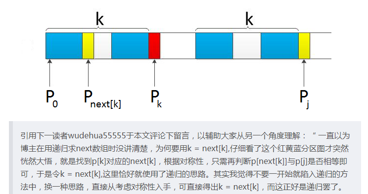

# 文章总结

---

### 1. 字符串匹配

- #### Sunday算法
  
  **Sunday 算法**  与  [**KMP 算法**](http://mp.weixin.qq.com/s?__biz=MzUyNjQxNjYyMg==&mid=2247485939&idx=1&sn=b25f39b5644da92c4047bbbd9936f73c&chksm=fa0e6672cd79ef64dda0a21e23c2817edf4a64cbb75b9bed328d6519c6cd4fef36d03a4cb309&scene=21#wechat_redirect)  一样是从前往后匹配，在匹配失败时关注的是主串中参加匹配的最末位字符的下一位字符。
  
  - 如果该字符没有在模式串中出现则直接跳过，即移动位数 = 模式串长度 + 1；
  
  - 否则，其移动位数 = 模式串长度 - 该字符***最右***出现的位置(以0开始) = 模式串中该字符最右出现的位置到尾部的距离 + 1。

- #### KMP算法（主要求next数组）
  
  - 先求所有从0开始的子串的前缀和后缀匹配的最大长度
  
  - next数组相当于将最大长度数组向右移动一位，并在第一位置为-1
  
  - 
  
  - ```
    void GetNext(char* p,int next[])
    {
        int pLen = strlen(p);
        next[0] = -1;
        int k = -1;
        int j = 0;
        while (j < pLen - 1)
        {
            //p[k]表示前缀，p[j]表示后缀
            if (k == -1 || p[j] == p[k]) 
            {
                ++k;
                ++j;
                next[j] = k;
            }
            else 
            {
                k = next[k];
            }
        }
    }
    ```



### 

### 2. Knuth洗牌算法

- 直接先上代码

```
for(int i=n-1; i>=0; i--)
    swap(arr[i], arr[rand() % (i+1)])
```

- 相当于将第i位的元素随机与前i位（包括自己）元素交换位置

- 某元素在第i位的概率为1/i

- 在i-1位的概率为`((i-1)/i) *(1/(i-1))=1/i`

- 容易得出所有元素的在某一位置都是相等的

### 

### 3.正则表达式匹配

**我们假设当前问题是考虑 s 的第 i 个字母，p 的第 j 个字母，所以这时的子问题是 s[0…i] 和 p[0…j] 是否匹配**：

- p[j] 是字母，并且 s[i] == p[j]，当前子问题成立与否取决于子问题 s[0…i-1] 和 p[0…j-1] 是否成立

- p[j] 是 '.'，当前子问题成立与否取决于子问题 s[0…i-1] 和 p[0…j-1] 是否成立

- p[j] 是字母，并且 s[i] != p[j]，当前子问题不成立

- p[j] 是 '*'，s[i] == p[j - 1]，或者 p[j - 1] == '.'， 当前子问题成立与否取决于子问题 s[0…i-1] 和 p[0…j] 是否成立

- p[j] 是 '*'，s[i] != p[j - 1]，当前子问题正确与否取决于子问题 s[0…i] 是否匹配 p[0,…j-2]

### 

### 4. 卡特兰数

        Catalan数的定义令h(1)=1，Catalan数满足递归式：`h(n) = h(1)*h(n-1) + h(2)*h(n-2) + ... + h(n-1)h(1)，n>=2`该递推关系的解为：`h(n) = C(2n-2,n-1)/n，n=1,2,3,...`（其中C(2n-2,n-1)表示2n-2个中取n-1个的组合数）

- 相当于出栈和入栈的组合，假设入栈为Y，出栈为D，则D之前必须要有Y的存在

- #### ***经典问题***

- ##### 括号化问题
  
  - 只用括号表示成对的乘积，试问有几种括号化的方案？
  
  - 当前串的右括号的数量必须小于左括号的数量
  
  - 公式 $h(n) = \frac{1}{n+1}*C_n^{2n} = \frac{(2n)!}{(n+1)n!}$

- ##### 多边形三角划分
  
  - 一个n边形能被n-1条边划分成多少种三角形（边互不相交）
  
  - h(1)相当于划分的第一条边，h(n-1)相当于划分后的n-1边形

- ##### 出栈次序问题。
  
  - 一个栈(无穷大)的进栈序列为1、2、3、...、n，有多少个不同的出栈序列?
  
  - 有2n个人排成一行进入剧场。入场费5元。其中只有n个人有一张5元钞票，另外n人只有10元钞票，剧院无其它钞票，问有多少中方法使得只要有10元的人买票，售票处就有5元的钞票找零？

- ##### 给顶节点组成二叉树的问题。
  
  - 给定N个节点，能构成多少种形状不同的二叉树？
  
  - 先取一个点作为顶点，然后左边依次可以取0至N-1个相对应的，右边是N-1到0个，两两配对相乘，就是`h(0)*h(n-1) + h(2)*h(n-2) + ...... + h(n-1)h(0)=h(n)) `

### 

### 5. 二分查找法

- 先上代码
  
  ```java
  public static int binary(int[] arr, int val)
  {
      int min = 0, max = arr.length - 1, mid;
      while(min <= max)
      {
          mid = (min + max) / 2;
          if(arr[mid] > val)
              max = mid - 1;
          else if(arr[mid] < val)
              min = mid + 1;
          else return mid;
      }
      return -1;
  }
  ```

- 上述代码的bug：`min + max`可能会溢出

- 修复方案
  
  - `min + (max - min) / 2`先减后加
  
  - `mid = min + ((max - min) >>> 1)`利用无符号移位符，道理都差不多

### 

### 6. 滑动窗口
