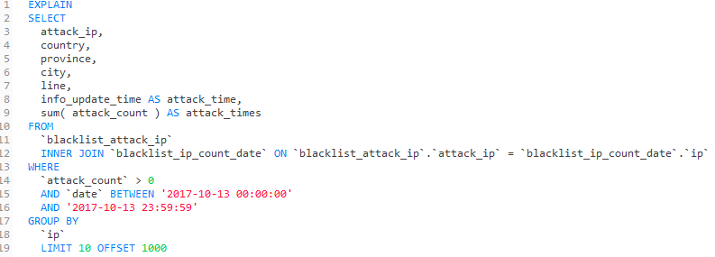
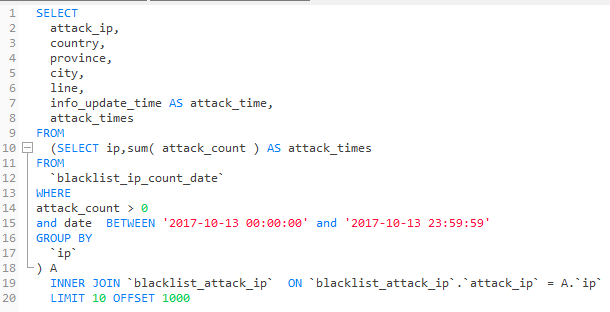

# 数据库

1. ### （大量数据）多表联合查询优化
   
   - Mysql 是先执行内联表然后再进行条件查询的最后再分组
   
   - 我们可以尝试一下提前进行分组和条件查询，实现方法就是子查询联合内联查询
   
   
   
   
   
   ###### 
   
   - 减少临时表？？这个不懂
   
   - 查找了网上一些博客分析GROUP BY 与临时表的关系 : 
     
     1. 如果GROUP BY 的列没有索引,产生临时表. 
     2. 如果GROUP BY时,SELECT的列不止GROUP BY列一个,并且GROUP BY的列不是主键 ,产生临时表. 
     3. 如果GROUP BY的列有索引,ORDER BY的列没索引.产生临时表. 
     4. 如果GROUP BY的列和ORDER BY的列不一样,即使都有索引也会产生临时表. 
     5. 如果GROUP BY或ORDER BY的列不是来自JOIN语句第一个表.会产生临时表.
     6. 如果DISTINCT 和 ORDER BY的列没有索引,产生临时表.

2. ### 索引
   
   - #### MySQL索引实现
     
         在MySQL中，索引属于存储引擎级别的概念，不同存储引擎对索引的实现方式是不同的，本文主要讨论MyISAM和InnoDB两个存储引擎的索引实现方式。
   
   - ##### MyISAM索引实现
     
     - MyISAM引擎使用B+Tree作为索引结构，叶节点的data域存放的是数据记录的地址。下图是MyISAM索引的原理图： 
     
     
     
     - 这里设表一共有三列，假设我们以Col1为主键，则上图是一个MyISAM表的主索引（Primary key）示意。可以看出MyISAM的索引文件仅仅保存数据记录的地址。在MyISAM中，主索引和辅助索引（Secondary key）在结构上没有任何区别，只是主索引要求key是唯一的，而辅助索引的key可以重复。
     
     - MyISAM的索引方式也叫做“非聚集”的，之所以这么称呼是为了与InnoDB的聚集索引区分。
     
     ####
   
   - ##### InnoDB索引实现
     
     - 第一个重大区别是InnoDB的数据文件本身就是索引文件。
       
       - MyISAM索引文件和数据文件是分离的，索引文件仅保存数据记录的地址。而在InnoDB中，表数据文件本身就是按B+Tree组织的一个索引结构，这棵树的叶节点data域保存了完整的数据记录。
       
       - InnoDB表数据文件本身就是主索引。
       
       - 这种索引叫做**聚集索引**
       
       - 因为InnoDB的数据文件本身要按主键聚集，所以InnoDB要求表必须有主键（MyISAM可以没有），如果没有显式指定，则MySQL系统会自动选择一个可以唯一标识数据记录的列作为主键，如果不存在这种列，则MySQL自动为InnoDB表生成一个隐含字段作为主键，这个字段长度为6个字节，类型为长整形。
     
     
     
     #### 
     
     - 第二个与MyISAM索引的不同是InnoDB的辅助索引data域存储相应记录主键的值而不是地址。
   
   #### 
   
   - ##### 聚集与非聚集效率
     - 聚集索引这种实现方式使得按主键的搜索十分高效，但是辅助索引搜索需要检索两遍索引：首先检索辅助索引获得主键，然后用主键到主索引中检索获得记录。
     
     - 聚集索引所有辅助索引都引用主索引，过长的主索引会令辅助索引变得过大。
     
     - 因为InnoDB数据文件本身是一颗B+Tree，非单调的主键会造成在插入新记录时数据文件为了维持B+Tree的特性而频繁的分裂调整，十分低效，而使用自增字段作为主键则是一个很好的选择。

## 

- #### 索引使用策略及优化
  
  ##### 

- ##### 联合索引及最左前缀原理
  
  - **联合索引（复合索引）**
    
    - 相对于一般索引只有一个字段，联合索引可以为多个字段创建一个索引。
    
    - 我们在（a,b,c）字段上创建一个联合索引，则索引记录会首先按照A字段排序，然后再按照B字段排序然后再是C字段
    
    - 第一个字段一定是有序的，当第一个字段值相等的时候，第二个字段又是有序的
  
  ##### 

- **前缀索引**
  
  - 前缀索引就是用列的前缀代替整个列作为索引key，当前缀长度合适时，可以做到既使得前缀索引的选择性接近全列索引，同时因为索引key变短而减少了索引文件的大小和维护开销。
  
  - 字符串列(varchar,char,text等)，需要进行全字段匹配或者前匹配。也就是=‘xxx’ 或者 like ‘xxx%’
  
  - MySQL 前缀索引能有效减小索引文件的大小，提高索引的速度。但是前缀索引也有它的坏处：MySQL 不能在 ORDER BY 或 GROUP BY 中使用前缀索引，也不能把它们用作覆盖索引(Covering Index)。
  
  #### 

- #### 索引优化策略
  
  - 最左前缀匹配原则，上面讲到了
  
  - 主键外键一定要建索引
  
  - 对 where,on,group by,order by 中出现的列使用索引
  
  - 对较小的数据列使用索引,这样会使索引文件更小,同时内存中也可以装载更多的索引键
  
  - 为较长的字符串使用前缀索引
  
  - 尽量的扩展索引，不要新建索引。比如表中已经有a的索引，现在要加(a,b)的索引，那么只需要修改原来的索引即可
  
  - 对于like查询，”%”不要放在前面。 
  
  ```
  SELECT * FROM houdunwang WHERE uname LIKE'后盾%' -- 走索引
  SELECT * FROM houdunwang WHERE uname LIKE "%后盾%" -- 不走索引
  ```
  
  - 查询where条件数据类型不匹配也无法使用索引 
  
  ```sql
  //字符串与数字比较不使用索引;
  CREATE TABLEa(achar(10));
  EXPLAIN SELECT * FROMaWHEREa="1" – 走索引
  EXPLAIN SELECT * FROM a WHERE a=1 – 不走索引
  ```
  
  - 正则表达式不使用索引,这应该很好理解,所以为什么在SQL中很难看到regexp关键字的原因
  
  - 尽量选择区分度高的列作为索引,区分度的公式是count(distinct col)/count(*)，表示字段不重复的比例，比例越大我们扫描的记录数越少，唯一键的区分度是1，而一些状态、性别字段可能在大数据面前区分度就是0
  
  - 索引列不能参与计算，保持列“干净”，比如from_unixtime(create_time) = ’2014-05-29’就不能使用到索引，原因很简单，b+树中存的都是数据表中的字段值，但进行检索时，需要把所有元素都应用函数才能比较，显然成本太大。所以语句应该写成create_time = unix_timestamp(’2014-05-29’);
  
  - 不要过多创建索引, 权衡索引个数与DML之间关系，DML也就是插入、删除数据操作。这里需要权衡一个问题，建立索引的目的是为了提高查询效率的，但建立的索引过多，会影响插入、删除数据的速度，因为我们修改的表数据，索引也需要进行调整重建

---
