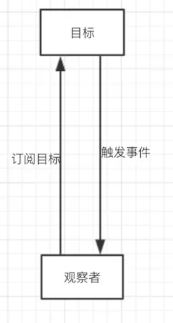
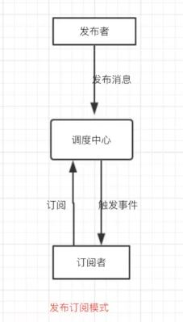

# 设计模式知识点

### 1. 单例模式([ref](https://blog.csdn.net/cselmu9/article/details/51366946))

- 线程不安全法
  
  ```java
  public class MySingleton {
  
      private static MySingleton instance = null;
      public static MySingleton getInstance() {
          if(instance == null){//懒汉式
              instance = new MySingleton();
          }
          return instance;
      }
      private MySingleton(){}
  }
  ```

- 线程安全的方法
  
  - “饿汉式”单例
  
  ```java
  public class MySingleton {
  
      private static MySingleton instance = new MySingleton();
      public static MySingleton getInstance() {
          return instance;
      }
      private MySingleton(){}
  }
  ```

- 内部类
  
  ```java
  public class MySingleton {
  
    //内部类
    private static class MySingletonHandler{
        private static MySingleton instance = new MySingleton();
    } 
  
    public static MySingleton getInstance() {
        return MySingletonHandler.instance;
    }
  
    private MySingleton(){}
  }
  ```

###### 

### 2. 工厂模式（[ref](https://blog.csdn.net/u012156116/article/details/80857255)）

- #### 简单工厂模式
  
  - ###### 定义
    
    - 工厂类需要接收客户端的创建类型
    
    - 根据类型判断创建具体的实例
    
    - 对于客户端来说，去除了具体的类的依赖。只需要给出具体实例的描述给工厂，工厂就会自动返回具体的实例对象。
  
  - ###### 优缺点
    
    - 工厂隐藏了这些细节
    
    - 需要在方法里写很多与对象创建有关的业务代码
    
    - 每次增加子类或者删除子类对象的创建都需要打开这简单工厂类来进行修改
    
    - 庞大臃肿、耦合性高、违反了开-闭原则。
  
  ```java
  public class EasyFactory {
      // 简单工厂，根据字符串创建相应的对象
      public static Operation createOperation(String name) {
          Operation operationObj = null;
          switch (name) {
              case "+":
                  operationObj = new Add();
                  break;
              case "-":
                  operationObj = new Sub();
                  break;
          }
          return operationObj;
      }
  }
  ```

- #### 工厂方法模式
  
  - ###### 定义
    
    - 使用对应的工厂子类生成对应的对象
    
    - 工厂基类仅做抽象类
  
  - ###### 优缺点
    
    - 工厂方法模式对简单工厂模式解耦的一个体现
    
    - 克服了简单工厂会违背开-闭原则的缺点，又保持了封装对象创建过程的优点
    
    - 工厂方法模式的缺点是每增加一个产品类，就需要增加一个对应的工厂类，增加了额外的开发量。
    
    ```java
    public interface Factory {
    
        public Operation createOperation() ;
    
    }
    public class AddFactory implements Factory{
        public Operation createOperation() {
            System.out.println("加法运算");
            return new Add();
        }
    }
    
    // 减法类工厂
    public class SubFactory implements Factory{
        public Operation createOperation() {
            System.out.println("减法运算");
            return new Sub();
        }
    }
    ```
  
  - #### 抽象工厂模式
    
    - ###### 定义
      
      - 相当于在工厂方法模式的工厂子类中有多个创建不同对象的方法
    
    - ###### 优缺点
      
      - **让具体的创建实例过程与客户端分离**
      
      - 如果你的需求来自增加功能，需要修改较多的类
    
    ```
    public class MysqlFactory implements IFactory{
        public IUser createUser() {
            return new MysqlUser();
        }
    
        public ILogin createLogin() {
            return new MysqlLogin();
        }
    }
    ```

###### 

### 3. 观察者模式 VS 订阅模式

- ##### 观察者模式
  
  - 当对象间存在一对多关系时，则使用观察者模式（Observer Pattern）。比如，当一个对象被修改时，则会自动通知它的依赖对象。
  
  - 观察者模式属于**行为型模式**。
  
  - 观察者负责出发事件的逻辑函数
  
  - 目标（被观察者）通过维持一张观察者的表，来通知每一位观察者
  
  - 

- ##### 订阅模式
  
  - 订阅模式相对于观察者模式增加了一个消息调度中心
  
  - 结构更加低耦合
  
  - 发布者仅负责发布对应的事件类型
  
  - 调度中心负责将订阅了对应类型事件的订阅者的事件调用
  
  - 订阅者仅向调度中心订阅需要的事件类型
  
  - 

###### 

### 4. 建造者模式

- 建造者模式（Builder Pattern）使用多个简单的对象一步一步构建成一个复杂的对象。

- 这种类型的设计模式属于创建型模式，

- ###### 优缺点
  
  - 1、建造者独立，易扩展。 
  
  - 2、便于控制细节风险。
  
  - 1、产品必须有共同点，范围有限制。
  
  - 2、如内部变化复杂，会有很多的建造类。

- ###### 关键示例代码
  
  ```java
  //可以通过不断add item 到 meal中进行构造复杂的meal对象
  //但add的对象都要为相同的item基类
  public class MealBuilder {
  
     public Meal prepareVegMeal (){
        Meal meal = new Meal();
        meal.addItem(new VegBurger());
        meal.addItem(new Coke());
        return meal;
     }   
  
     public Meal prepareNonVegMeal (){
        Meal meal = new Meal();
        meal.addItem(new ChickenBurger());
        meal.addItem(new Pepsi());
        return meal;
     }
  }
  ```

###### 

### 5. 原型模式

- 原型模式（Prototype Pattern）是用于创建重复的对象，同时又能保证性能。这种类型的设计模式属于创建型模式

- ###### 优缺点
  
  - 1、性能提高。 2、逃避构造函数的约束。
  
  - 1、配备克隆方法需要对类的功能进行通盘考虑，这对于全新的类不是很难，但对于已有的类不一定很容易，特别当一个类引用不支持串行化的间接对象，或者引用含有循环结构的时候。
  
  - 2、必须实现 Cloneable 接口。

- ###### 步骤
  
  - 创建一个实现了 *Cloneable* 接口的抽象类。（eg. shape类）
  
  - 创建扩展了上面抽象类的实体类。（eg. rectangle类，square类）
  
  - 创建一个类，从数据库获取实体类，并把它们存储在一个 *Hashtable* 中。
  
  - 使用 *ShapeCache* 类来获取存储在 *Hashtable* 中的形状的克隆。
  
  
