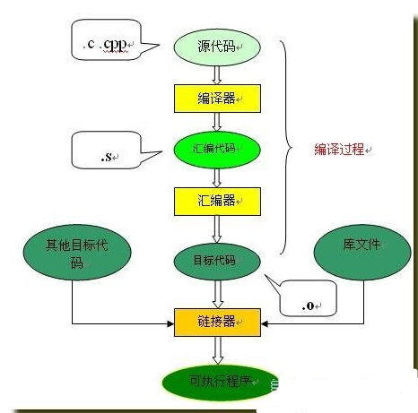

# C plus plus

1. ### 内存泄漏
   
   - **定义**
     
     - 在编写应用程序的时候，程序分配了一块内存，但已经不再持有引用这块内存的对象（通常是指针）
     
     - 虽然这些内存被分配出去，但是无法收回，将无法被其他的进程所使用
     
     - 被泄漏的内存将在整个程序声明周期内都不可使用
   
   ###### 
   
   - **原因**
     
     - 是在使用new或malloc动态分配堆上的内存空间，而并未使用delete或free及时释放掉内存。
   
   ###### 
   
   - **危害**
     
     - 虽然这些内存被分配出去，但是无法收回，将无法被其他的进程所使用
     
     - 被泄漏的内存将在整个程序声明周期内都不可使用
       
       ###### 
   
   - **情况**
     
     - **类所有动态分配的成员变量**，一定记得在析构函数中全部进行判断释放内存。
     
     - **指针容器** ,使用`std::vector<CType*>`时，记得在clear或是删除一个元素之前，应该释放指针指向的内容。
     
     - **资源泄漏**,有些类型对象如CDialog，CWindow，CFile，CImage等需要在Delete前做Close、Release、Destroy等操作的，Delete时检查是否已经调用了相应的扫尾函数。 这个要具体情况具体分析了，比如CDialog的子类销毁时往往需要先调用OnDestroy或是DestroyWindow，不然就可能会存在资源泄漏的问题。
     
     - **异常分支**，若正常分支有内存需要释放，则不要忘了异常分支的内存释放如try语句的catch分支，函数中的多个return分支都要考虑到相应内存的释放。
     
     - **不为虚的析构函数**，因为编译器会认为你删除的是一个基类类型的指针，当然就不会去调用子类的成员变量的析构函数的了
     
     - **线程的安全退出**，防止线程不安全退出导致内存泄漏，线程进行安全退出，防止非正常退出的内存泄漏问题。
     
     - **delete void * 的指针**，导致没有调用到对象的析构函数，析构的所有清理工作都没有去执行从而导致内存的泄露；
   
   #### 

2. ### 内存越界（内存溢出）
   
   - **定义**
     
     - 读越界，即读了不属于自己的数据。如果所读的内存地址是无效的，程序立刻崩溃；如果所读内存地址是有效的，在读的时候不会马上出现问题，但由于读到的数据是随机的，因此它会造成不可预料的后果。
     
     - 写越界，又称为缓冲区溢出，所写入的数据对别的程序来说是随机的，它也会造成不可预料的后果。
     
     ###### 
   
   - **危害**
     
     - 导致程序崩溃
       
       - 越界后程序对内存的访问会出现错误的，因为程序得不到正确结果。在实际执行过程中，当你使用的地址长度超过预计的分配长度时，程序也不会出错，但是如果程序使用的内存对运行环境造成了破坏，程序甚至文件系统就会崩溃。
       
       - 由于程序的运行相关信息，如关于栈信息ebp esp(函数返回后main下一条指令地址)， 指令指针eip等都在内存的某个位置，一旦越界访问到这些位置并修改，那么程序会因为由于错误的堆栈信息，从而导致程序的崩溃。
       
       ###### 
   
   - **情况**
     
     - **数组越界**
     
     - **memcpy(),memmove()**，写入超过申请的内存
     
     - **strcpy()**，改用strncpy()，超过会停止
     
     - 使用memcpy复制字符串，避免忽略字符串最后的'\0'字符而导致的越界
       
       ```cpp
       memcpy(c, str, strlen(str));
       ```
       
       # 
       
       ###### 
   
   #### 

3. ### 编译过程
   
   
   
   - ##### **编译预处理**
     - 读取C/C++源程序，对其中的伪指令（以#开头的指令）进行处理
       
       - 将所有的“#define”删除，并且**展开所有的宏定义**
       
       - 处理所有的**条件编译指令**，如：`“#if”、“#ifdef”、“#elif”、“#else”、“endif”`等。
       
       - **处理“#include”预编译指令**，将被包含的文件插入到该预编译指令的位置（注意：这个过程可能是递归进行的，也就是说被包含的文件可能还包含其他文件）
     
     - **删除注释**
     
     - **添加行号和文件名标识**。
       
       - 以便于编译时编译器产生调试用的行号信息及用于编译时产生的编译错误或警告时能够显示行号
     
     - **保留#pragma编译器指令**
   
   ###### 
   
   - ##### **编译、优化阶段**
     
     - 将预处理完的文件进行一系列**词法分析**、**语法分析**、**语义分析**及**优化**后，产生相应的汇编代码文件。
     
     - **优化**
       
       
       
       ###### 
   
   - ##### **汇编阶段**
     
     - 汇编器是将汇编代码转变成机器可以执行的指令，每一个汇编语句几乎都对应一条机器指令。所以汇编器的汇编过程相对于编译器来讲比较简单，它没有复杂的语法，也没有语义，也不需要做指令优化，只是根据汇编指令和机器指令的对照表一一翻译即可。
     
     - 目标文件由段组成。通常一个目标文件中至少有两个段：
       
       1) **代码段**：该段中所包含的主要是程序的指令。该段一般是可读和可执行的，但一般却不可写。
       
       2) **数据段**：主要存放程序中要用到的各种全局变量或静态的数据。一般数据段都是可读，可写，可执行的。
   
   ###### 
   
   - ##### **链接程序**
     - 链接程序的主要工作就是将有关的目标文件彼此相连接，也即将在一个文件中引用的符号同该符号在另外一个文件中的定义连接起来，使得所有的这些目标文件成为一个能够被操作系统装入执行的统一整体。
     
     - 分为：
       
       - 静态链接
       
       - 动态链接

#### 

4. ### 静态链接与动态链接
   - #### 静态链接
     - 函数和数据被编译进一个二进制文件(通常扩展名为.LIB)。在使用静态库的情况下，在编译链接可执行文件时，链接器从库中复制这些函数和数据并把它们和应用程序的其它模块组合起来创建最终的可执行文件
     - **缺点：**
       - 空间浪费
       
       - 静态链接对程序的更新、部署和发布会带来很多麻烦。一旦程序中有任何模块更新，整个程序就要重新链接，发布给用户。
   
   ##### 
   
   - #### 动态链接
     
     - 把程序按照模块拆分成各个相对独立的部分，在程序运行时才将它们链接在一起形成一个完整的程序，而不是想静态链接一样把所有的程序模块都链接成一个单独的可执行文件。
     
     - **特点：**
       
       - 代码共享，所有引用该动态库的可执行目标文件共享一份相同的代码与数据。
       
       - 程序升级方便，应用程序不需要重新链接新版本的动态库来升级，理论上只要简单地将旧的目标文件覆盖掉。
       
       - 在运行时可以动态地选择加载各种应用程序模块
   
   ##### 
   
   - #### 区别
     
     - **lib是编译时用到的，dll是运行时用到的。**如果要完成源代码的编译，只需要lib；如果要使动态链接的程序运行起来，只需要dll。
     
     - **如果有dll文件，那么lib一般是一些索引信息**，记录了dll中函数的入口和位置，dll中是函数的具体内容；
     
     - 如果只有lib文件，那么这个lib文件是静态编译出来的，**索引和实现都在其中**。
     
     - 使用静态编译的lib文件，在运行程序时不需要再挂动态库，缺点是导致**应用程序比较大**，而且失去了动态库的灵活性，发布新版本时要**发布新的应用程序才行**。
     
     - 动态链接的情况下，有两个文件：一个是LIB文件，一个是DLL文件。`LIB包含被DLL导出的函数名称和位置`，`DLL包含实际的函数和数据`，应用程序使用LIB文件链接到DLL文件。在应用程序的可执行文件中，存放的`不是被调用的函数代码，而是DLL中相应函数代码的地址`，从而节省了内存资源。DLL和LIB文件必须随应用程序一起发行，否则应用程序会产生错误。
