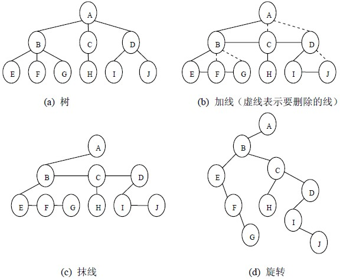
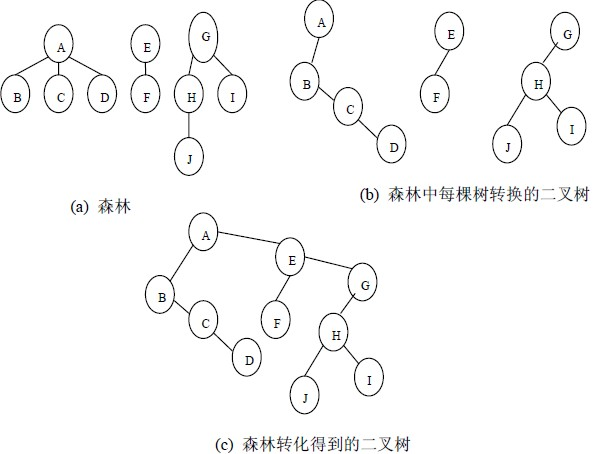

## 森林变树

> [参考网址1](https://www.cnblogs.com/KennyRom/p/6064662.html)
> 
> [参考网址2](https://blog.csdn.net/linraise/article/details/11745559)

#### 树转换为二叉树的步骤(连兄弟，砍儿子)

* 在树所有的兄弟节点，之间连成一条线
* 对每个结点，除了保留与其长子的连线外，去掉该节点与其他孩子的连线
* 连接兄弟节点
* 保留长子，去掉其他孩子的连线
* 调整位置
* __树变成二叉树只有左子树__

#### 森林到二叉树的转换（变二叉，连根节点）

* 先将森林中每棵树变成二叉树
* 再将各二叉树的根节点视为兄弟从左到右连在一起，就形成了一颗二叉树
* __既有左子树也有右子树__

#### 二叉树到树与森林的转换（根连右子，下面砍右子）

* 若结点x是其父节点y的左孩子，则把x的右孩子，右孩子的右孩子，……，都与y用线连起来
* 去掉父节点到右孩子的所有连线
* __判断一棵二叉树能够转换成一棵树还是森林，标准为，只要这棵树的根结点有右孩子就是森林，没有就是树。__

##
